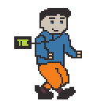

# TDC Game

Et (eller flere spill) som kan spilles ved å trykke en enkelt knapp.

Ambisjonen er at det skal kunne vibes ut et spill av de som er på konferansen.

Vi lagre en JSON-struktur som menneske eller LLM-gamedevs kan forholde seg til.

# Koden

Bruker [ebiten](https://ebitengine.org/) som spillmotor. Det er en veldig enkel spillmotor for go.

Koden er delt inn i noen deler:

- `main.go` - setter opp spillet, størrelse på vindu osv
- `player.go` - logikk for hvordan spilleren beveger seg, collision detection og hvilke animasjoner som spilles
- `game.go` - selve spillet. Her styres camera, og vi tegner inn bakken, fiender og andre assets
- `sprites.go` - laste inn assets, dele inn i spritesheets og logikk for animasjoner ligger her

# Assets/pixelart

I mappen assets ligger pixelart.

For å editere pixelart er det enklest å bruke et program som er laget for pixelart. De beste alternativene er:

- [Aseprite](https://www.aseprite.org/) - Koster 150 kroner og er veldig bra, alle youtube-tutorials bruker dette (Jeg (Anders) bruker dette). Det er open source så man kan få det gratis hvis man bygger fra source :D
- [Pixelorama](https://pixelorama.org/) - Gratis og veldig bra, men ikke like mye brukt av "proffe"

Man kan importere spritesheet fra png i begge disse.

Trykk import og import spritesheet, deretter sett størrelsen på spriten og importer.

Man har lyst å ende opp med riktig antall frames.

# Ide til art/konsept

- Konferansedeltager
- Løper gjennom konferansen og samler sokker
- Fiender: Rekrutterere? (hvordan tegne)
  - Andre selskaper? Minuspoeng for å treffe webstep eller bekk sin logo
  - Eller bare en kjent fiende (hufsa, skjelett, bjørn, ulv)
- Powerups er kaffe, redbull, mat, godteri, etc



Pixeldugnad i juni?

# Backlog/todos

- [x] Splitte kodebasen ut i flere filer
- [ ] x, y koordinatene er litt rotete nå. Hvor skal origo være? Gir mening at 0,0 er nederst til høyre. Nå er y = 0 midt på skjermen i noen tilfeller. Enklere for implemtantør av spill hvis dette gir mer mening
- [x] Skrive en liten readme på kodebasen (Anders)
- [x] Skrive en liten readme på pixelart (verktøy, hvordan laste inn spritesheet) (Anders)

## POC - Mario Run aktig

- [ ] Laste inn spillstate fra json
- [ ] Lage en måte å tegne platformer (kan være en grønn firkant på 16px høye og 96px brede i første omgang)
- [ ] Sette ut platformer på x,y koordinter som er definert i json
- [ ] Automatisk resette (eller loope fra start) hvis man når slutten
  - [ ] Ide: Powerups varer selv om vi looper, kan løpe raskere og raskere gjennom. Eller låse opp nye deler av banen siden man kanskje hopper høyere eller lenger.

## Videre jobbing (etter POC)

- [ ] Lage bakgrunn
- [ ] Vise poeng på skjermen
- [ ] Avslutning av spill. Hvert spill kan sette en tidsgrense. Når spillet er ferdig vis poengsum. Bør ha en maksgrense på varighet (2-3 minutter).
  - [ ] Ide/forslag: Avslutt spill hvis det ikke skjer noe. Avslutt hvis det ikke har blitt gitt poeng på 30 sekunder
- [ ] Trykk knapp for spill igjen, dobbeltrykk for neste spill?
- [ ] Mulig å endre hva slags actions knappen er bundet til. Default er jump. Men vi kan støtte double og triple click også. Må da ha forskjellige ations som kan velges blandt.

# Vibe-støtte

- [ ] Portal der brukere kan gi en prompt som resulterer i en generet json (kanskje med en validator som validerer at json er gyldig)
- [ ] JSON sendes til spillet på et vis? (Enklest er sikkert å polle et repo som portalen pusher til 🤷)

Kladd for json

```json

{
  "gameProperties"": {
    "WalkSpeed"  : "100.0" // px/sec
    "JumpSpeed"  : "60"
    "Gravity"    : "600"  // px/sec^2
    "JumpForce"  : "-250" // negative means up
    "GroundY"    : "148"  // positive means down, 0 is center
    "AirControl" : "0.5"
  },
  "gameObjects": [
    {
      "type": "Block",
      "position": { x: 20, y: 120},
      "typeParams": {
          "size": "large"
      },
      "type": "Powerup",
      "position": { x: 20, y: 100},
      "typeParams": {
          "power": "jump",
          "value": "100" // Støtte flere typer values, feks % eller flat verdi?
      },
      "type": "Reward",
      "position": { x: 200, y: 120},
    }
  ]
}

```

# Ideer vi kan støtte

- Mario Run (platformer der man automatisk løper mot høyre og hopper)
- Frogger - ide til implemantasjon: trykk en gang for opp, to ganger for tilbake. Kan endre på jump
- Guitar hero aktig. Noe flyter bortover og man må trykke hoppknappen inn for å treffe riktig rad med powerups.

# Entiteter å støtte

## Platformer/fysiske hindringer

Kan være firkant tegnet i kode.
Asset er nice to have.
Flere assets er veldig nice to have.

## Powerups:

- Spring fortere
- Hopp høyere
- Snu retning?
- Negative gravity

## Fiender

Mister poeng når man treffer.

## Noe som gir poeng

Variantsokker gir poeng
